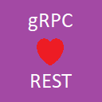

# MpSoft.AspNet.Grpc.MvcApi

### Description
MpSoft.AspNet.Grpc.MvcApi is library generating ASP.NET MVC API controllers for the gRPC services.

### Purpose
The gRPC is great for inter-services data communication. However, it's designed for modern technologies (namely HTTP/2) and its usage might break the service availability for legacy systems. This package brings the fallback feature to be available for REST clients.

### Features
* Generates MVC API controller for the gRPC service's methods
* Allows to customize the generated controller
* Compiles the controllers to dynamic assembly
* Allows to store/cache the generated assemblies

### Installation and Documentation
[See](./Documentation.md)

### Release notes
[See](./ReleaseNotes.md)
